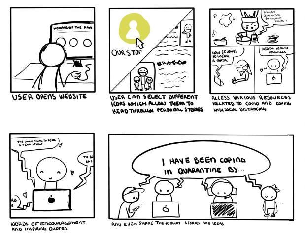

# Humans of Pandemic

## Objectives

Humans of the Pandemic is a community focused project based around
the commonality of the experiences during this crisis. Isolation and disconnection are
just as much of a threat as COVID-19. Humanity needs to be brought back
together in every way possible. By taking user submitted stories and linking them
together, this project creates a tapestry of experiences to draw on. Each story will give a look into
the day to day life of someone affected by the pandemic and something they have done
to cope and overcome their isolation. Maybe it’s their favorite sourdough recipe or the
struggles they have had learning a new instrument. It is significant to show that even in
isolation, the society can still have human connection and triumph.

## Storyboard

## Usability

The website has a match with the real world: the system speaks the user's
language, i.e. uses words and concepts familiar to the user, rather than system-oriented
terms. It follows real-world conventions and makes information appear in a natural and
logical order. The website provides a user with the freedom and ability to make choices
within a system: there is a navigation panel at the very top of every page that allows
the user to easily navigate within the website and return to the homepage anytime. All
the features provide a short but precise description of its functionality, thus the user
does not have to wonder what the buttons or link are doing and where they redirect to.
The website has an aesthetic and minimalist design: the combination of white and mint
colors does not make user feels overwhelmed with the website's background; the
captions and descriptions are short and precise; texts within the website have
distinguishable font-size and font-style for user to cooperate with them. The website is
explicit enough for any user to easily operate with it.

## Visual Compaign

This project creates awareness about COVID-19 and displays ways to prevent
people from getting it, staying safe while out in public, the importance of wearing a mask
and staying sanitized. It will also be showing them how serious the virus is and the
effects that it has had on people's lives and the country as a whole. The Ads will show
togetherness so that people will feel safe expressing their stories to other people. It will
also show interactions through zoom or phone calls to get updates about what to do for
covid and how to prevent getting it. The visual aspect will show that we are taking a
stance in trying to put a stop to COVID-19 and ensure all citizens safety. The drawings
will have different sections and resources the website provides as far as communicating
with everyday people going through the same issues as you and can relate. The Ads
provide words of encouragement and daily pick me ups to keep you striving and
give smart goals and suggestions to help people stay COVID-19 and Stress free.

### Conducted interview with Dr. Erin Dodge is about the current pandemic problem.
The text version can be accessed down below:
https://drive.google.com/file/d/11SxeMIHtZ2zDz4rgs5Aq7IJJwYN11NZc/view?usp=sharing

### Quotes/words of encouragement for the “Words of Encouragement” button.

* "The only thing we have to fear is fear itself" - Franklin Roosevelt
* "A life lived in fear is a life half lived" - Baz Luhrmann
* "Worry is like a rocking chair: It gives you something to do but never gets you
anywhere" - Erma Bombeck
* "Nothing in life is to be feared, it is only to be understood. Now is the time to
understand more, so that we may fear less" - Marie Curie
* "Don't worry 'bout a thing, cause every little thing's gonna be alright" - Bob Marley
* "I like to think of life as an adventure, like a roller coaster. It helps with the ups
and downs" - Eddie Izzard
* "Often when you think you're at the end of something, you're at the beginning of
something else" - Fred Rodgers
* "Better to be busy than to be busy worrying" - Angela Lansbury
* "Life isn't about waiting for the storm to pass. It's about learning how to dance in
the rain" - Vivian Greene
* "Let everyone sweep in front of his own door, and the whole world will be clean" -
Johann Wolfgang von Goethe
* "That which does not kill us, makes us stronger" - Friedrich Nietzsche
* "Life will give you whatever experience is most helpful for the evolution of your
consciousness" - Eckhart Tolle
* "I shall pass this way but once; any good that I can do or kindness I can show to
any human being; let me do it now" - Etienne de Grellet

The project was made for NMC 260 New Media Features at Oregon State University 2020. 
